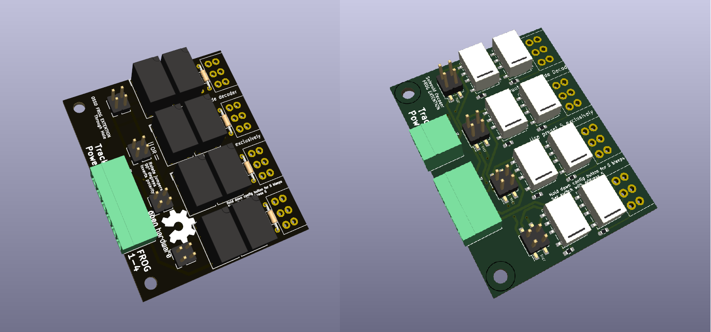

# elektro-frog-relay-extension

## 🧾 Documentation

This module is used in combination with the [OS-Solenoid-Decoder](https://github.com/Open-Source-Model-Railway-Electronics/OS-Solenoid-Decoder).

- 📄 [OS-Solenoid-Decoder Manual (PDF)](https://github.com/Open-Source-Model-Railway-Electronics/OS-Solenoid-Decoder/blob/main/docs/manual.pdf)

## 🖼️ Hardware Preview

